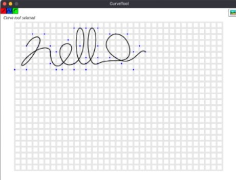

<h1>User-Designed-Connective-Structures</h1>
Our idea is to have a software such that takes in user input and output a curve for marble track

<h1>Instructions</h1>
https://www.edrawingsviewer.com/download-edrawings for viewing DFX on local computer  
https://www.onshape.com/en/ for viewing and editing DFX online 

The folder we mainly use will be "Turn2D3D" and other folders will not be directly related to the project itself but research oriented. 
The user can run Sketch.py in Turn2D3D, and use right clicks to create curves (every four right clicks will create 4 control points for a Bezier curve), the points of Bezier curve will be output in a text file named curveCoordinates.txt, which is used automatically to generate curves in dxf format and the file so far is named "test.dxf".  

<h1>Libraries</h1>
<h2>Ones used in MakeDXFCurve</h2>
<h6>This version allows you to make DXF <b>curve</b> by right clicking four times to make four control points, which the program then will automatically generate a test.dxf file according to the curve you got from control points</h6>
os  
wxpython  
math  
random  
numpy  
PIL  
<h2>Ones used in Connectivity</h2>
<h6>This version allows you to make DXF <b>curves</b> by right clicking four times to make four control points, and you can do that repeatively for a whole connected track. You can also draw straight lines. You can move to next layer by placing a special connector and click next button.</h6>
pygame  
math   
ezdxf   
bezier (there are potential errors with this library, if you are running into error, please use previer MakeDXFCurve version)  
dxfwrite(I include this in the repository so user can place it into their library folder)  

<h1>Report</h1>
https://docs.google.com/document/d/1r422rZli725Xf_rHzjm1X3xNgPw_heduPCVOU3lTeEs/edit?usp=sharing
 
<h1>User Interface</h1>

<h1>Final Result</h1>

